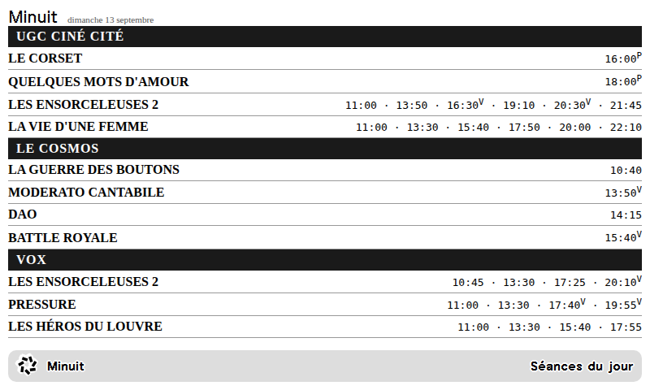

# Minuit × TRMNL 🎬

Plugin TRMNL qui affiche les séances de cinéma de **Strasbourg** sur un écran e-ink (800×480), alimenté par l'API publique de [minuit.wyliam.fr](https://minuit.wyliam.fr).

Style "departure board" : un bandeau par cinéma, titre du film en nombre, horaires alignés à droite en mono. Marqueurs `ᵛ` (VOST) et `ᴾ` (avant-première).



## Setup (5 min)

1. Sur [trmnl.com](https://trmnl.com), va sur **Plugins > Private Plugin** (ou https://trmnl.com/plugin_settings?keyname=private_plugin)
2. Clique **Edit Markup** et colle le contenu de [`minuit.liquid`](minuit.liquid)
3. Dans **Polling URL** (source de données du plugin), mets :
   ```
   https://minuit.wyliam.fr/api/v1/theater?days=0
   ```
   TRMNL stocke le JSON dans la variable `data` utilisée par le template.
4. **Preview** → vérifie le rendu, puis ajoute le plugin à ta **Playlist**.

## Paramètres

| Champ | Valeur | Description |
|---|---|---|
| Polling URL | `https://minuit.wyliam.fr/api/v1/theater?days=0` | Séances du jour (futur, filtrées). `days=1` = demain. |

L'API est cache-first (6 h de TTL SQLite) — aucun risque de surcharge.

## API sous-jacente

Voir [docs/API.md](https://github.com/WyliGr/Minuit) — agrégateur Allociné, sans auth, CORS ouvert.

## Preview

Le fichier [`preview.html`](preview.html) reproduit le rendu e-ink exact (800×480, CSS plugins TRMNL + design system).

## License

MIT
